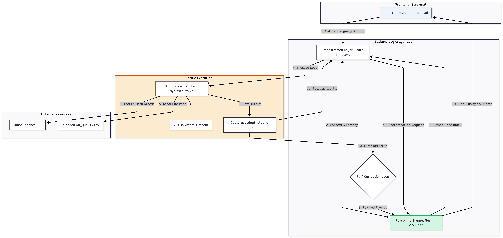

# 🤖 Agentic AI Data Analyst
### CISC 520: Data Engineering & Data Science Final Project

**Live Application**: [https://ai-data-agent-lnoffese5mtwzqktvrtzvi.streamlit.app/](https://ai-data-agent-lnoffese5mtwzqktvrtzvi.streamlit.app/)

An autonomous AI-powered web application designed to bridge the gap between natural language and complex data science. This system uses Large Language Models (LLMs) to plan, write, execute, and interpret Python code in real-time, providing an end-to-end "Agentic" experience for data exploration.

## 🚀 Key Features
* **Autonomous Pipeline**: Implements a complete "Plan → Code → Execute → Interpret" workflow.
* **Environment Synchronization**: Specifically engineered to solve cloud-deployment hurdles by forcing the agent's execution sandbox to align with the host's `sys.executable` environment.
* **Self-Correction (Scenario D)**: The agent autonomously detects runtime errors (e.g., FileNotFoundError, KeyError), analyzes the traceback, and regenerates corrected code without user intervention.
* **Financial Analytics (Scenario A)**: Real-time stock data ingestion via `yfinance`, statistical summaries (mean, std dev, volatility), and trend visualization.
* **Dynamic CSV Exploration (Scenario B)**: Intelligent analysis of uploaded datasets with automatic column identification, missing value reporting, and distribution plotting.
* **Statistical Comparison (Scenario C)**: Advanced comparison logic for multiple entities, including t-tests and rolling correlation analysis.

## 🛠️ System Architecture

*(Note: Ensure you upload your architecture diagram image to the repository and link it here)*


* **Frontend**: Developed using **Streamlit**, providing a conversational chat interface and dynamic file management.
* **Orchestration Layer**: A robust Python backend utilizing the **Google GenAI SDK** to manage conversation state and iterative agentic loops.
* **LLM Integration**: Powered by **Google Gemini 2.5 Flash** for high-speed reasoning, 404-error resolution, and accurate code generation.
* **Execution Sandbox**: Uses a subprocess-based approach to execute generated code, capturing `stdout` and `stderr` to feed back into the agent for self-correction.

## 🚧 Known Limitations
* **Static Visualizations**: The system currently generates static Matplotlib/Seaborn images. Interactive charts (like Plotly) are not yet supported in the UI rendering pipeline.
* **Data Scale**: The application is optimized for small to medium-sized CSV files. Extremely large datasets may hit Streamlit's memory limits or the agent's 45-second hardware execution timeout.
* **Database Access**: The agent currently only reads from uploaded flat files or external APIs (like yfinance); it does not currently support direct connections to SQL/cloud data warehouses.

## 📦 Setup & Installation
1.  **Clone the Repository**:
    ```bash
    git clone [https://github.com/lokesh-k09/ai-data-agent.git](https://github.com/lokesh-k09/ai-data-agent.git)
    cd ai-data-agent
    ```
2.  **Install Dependencies**:
    ```bash
    pip install -r requirements.txt
    ```
3.  **Configure Environment**:
    * Create a `.env` file in the root directory.
    * Add your Gemini API Key: `GEMINI_API_KEY=your_actual_key_here`.
    * Ensure `.gitignore` is active to prevent credential leaks.
4.  **Run the Application**:
    ```bash
    streamlit run app.py
    ```

## 📝 Example Prompts
* **Financial**: "Compare the daily closing prices of NVDA and TSLA for the last 6 months. Create a dual-axis plot showing raw prices and 20-day rolling correlation."
* **Data Analysis**: "Analyze the uploaded Air_Quality.csv. Identify the top 5 neighborhoods with the highest average Nitrogen Dioxide (NO2) levels and show a bar chart."
* **Agentic Fix**: "Calculate the average of the 'AirQualityIndex' column." (The agent will realize the column name is wrong and fix it to 'Data Value' automatically).

## 🤖 AI Tool Usage Documentation
In accordance with course guidelines, the development of this project was assisted by Generative AI tools. Below is the documentation of our AI usage:

* **Tools Used**: Google Gemini.
* **How They Were Used**: 
  * **Debugging**: Used to troubleshoot and resolve complex environment issues, specifically resolving `ModuleNotFoundError` during cloud deployment by suggesting the `sys.executable` approach for the subprocess sandbox. Also used to map out the steps for recovering from a Git credential leak (Git history purge).
  * **Code Refactoring & Generation**: Assisted in refining the Regular Expressions (Regex) used in the Orchestration layer to reliably extract Python code blocks from the LLM's raw text responses.
  * **Documentation**: Assisted in structuring and formatting this `README.md` file and drafting sections of the final PDF report to ensure clear technical communication.
* **Parts Assisted**: The core logic, prompt engineering, and UI architecture were designed by the team. AI was heavily leveraged for debugging the `subprocess` integration, refining the regex parser, and formatting documentation. All final code and configurations were reviewed, modified, and approved by the team.

## ⚠️ Safety & Reliability
* **Resource Guard**: All code executions are capped at 45 seconds via hardware timeout to prevent infinite loops.
* **Credential Security**: Repository underwent a complete Git history purge (Nuke) to resolve accidental leaks; keys are now managed via environment variables and Streamlit Secret vaults.
* **Rate Limiting**: Implements exponential backoff to handle Gemini API `429 RESOURCE_EXHAUSTED` and `503 Service Unavailable` errors gracefully.